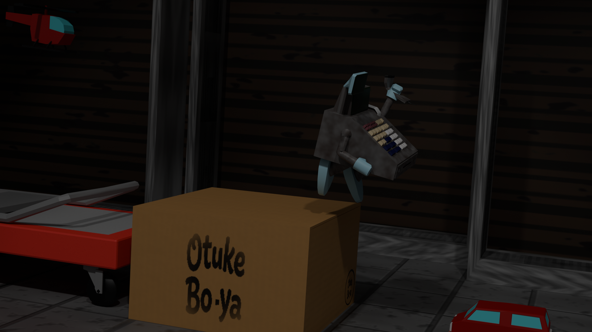

# DataBackTo ※現在制作中

> **「やり直す」ための対価は、印字された過去の記録。**
> 壊れかけのレジスターが夜のおもちゃ屋を駆ける、リソース管理型 2D横スクロールアクション。

---

## 📖 目次

- [ゲーム概要](#ゲーム概要)
- [コンセプト・世界観](#コンセプト世界観)
- [ゲームシステム](#ゲームシステム)
- [操作方法](#操作方法)
- [開発チーム・担当範囲](#開発チーム担当範囲)
- [技術詳細・開発ドキュメント](#技術詳細開発ドキュメント)

---

## 🎮 ゲーム概要

| 項目 | 内容 |
| --- | --- |
| **タイトル** | DataBackTo |
| **ジャンル** | リソース管理型 2D横スクロールアクション |
| **プレイ人数** | 1人 |
| **対応機種** | PC |
| **使用エンジン** | Unity |
| **制作人数** | 2名 |
| **制作期間** | 2026年1月22日～ |

---

## 🧩 コンセプト・世界観

**舞台は夜のおもちゃ屋。主人公は汚れた壊れかけの「レジスター」。**

本作は、プレイヤーの内部状態（HP・コイン・ジャンプ回数など）を保存し、必要なタイミングで**「過去の状態へ戻る」**ことで攻略を進める、独自のシステムを持ったアクションゲームです。

主人公がレジスターであることを活かし、状態の保存を**「レシートの発行」**、リソースを**「コイン」**に見立て、システムと世界観を密接に連携させています。

---

## ⚙️ ゲームシステム

1. **状態保存（レシート発行）**
   現在の主人公の状態（HP、コイン、ジャンプ回数）を記録し、レシートを発行します。
2. **状態復帰（過去への巻き戻し）**
   レシートを使用すると、記録された過去の状態へ即座に復帰します。HPが尽きた際も、レシートがあれば自動でコンティニューが可能です。
3. **シビアなリソース管理（HP・コイン）**
   歩行や攻撃などのアクションを行うたびに、主人公のHP（駆動電力）は徐々に減少します。ステージや敵から「コイン」を回収し、それを消費することで高機動アクション（多段ジャンプや強化攻撃）を発動できます。

---

## 🕹️ 操作方法

### 基本操作

| 行動 | 操作キー |
| --- | --- |
| **左右移動** | A / D または 矢印キー |
| **ジャンプ** | Space |
| **攻撃** | X / C / V / B / N / M |
| **下方攻撃（ヒップドロップ）**| ジャンプ中に攻撃キー |
| **状態保存（レシート発行）** | Enter長押し（2秒） |
| **状態復帰** | Enter |

### コイン消費アクション

| 行動 | 操作キー | 仕様 |
| --- | --- | --- |
| **多段ジャンプ** | Shift + ジャンプ | 2段目以降で発動。現在段数分のコインを消費 |
| **射撃攻撃** | Shift + 攻撃 | 1コイン消費。前方へコインを射出 |
| **強化ヒップドロップ** | 空中でShift + 攻撃 | 10コイン消費 |

※コインの必要量を満たさない場合は、通常動作となります。

---

## 👥 開発チーム・担当範囲

本プロジェクトは、2名のチームで開発を進行しています。

* **TodoSota**: プロジェクト主導、企画、コアゲームループの設計・実装、ビジュアル(3D)モデルの作成、ビジュアルモデルの組み込み
* **otukebo-ya**: 不足機能の実装、敵AIの構築、UI素材の作成、UIと内部システムの連動処理

---

## 🛠️ 技術詳細・開発ドキュメント

本作の開発工程（MVP的アプローチ）、アーキテクチャ設計、直面した技術的課題とその解決策については、以下のドキュメントにまとめています。エンジニアリングの観点からのアピールポイントとなりますので、ぜひご覧ください。

👉 **[開発・設計詳細資料（Implementation.md）はこちら](./Implementation.md)**