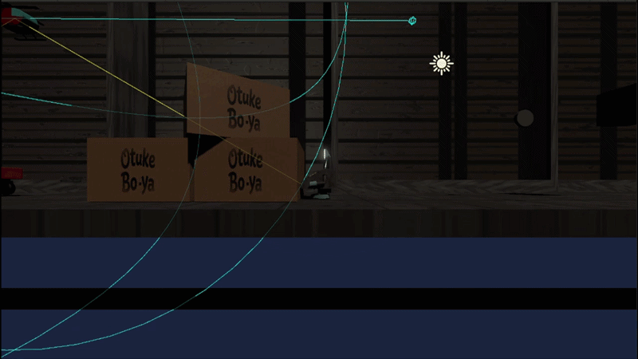
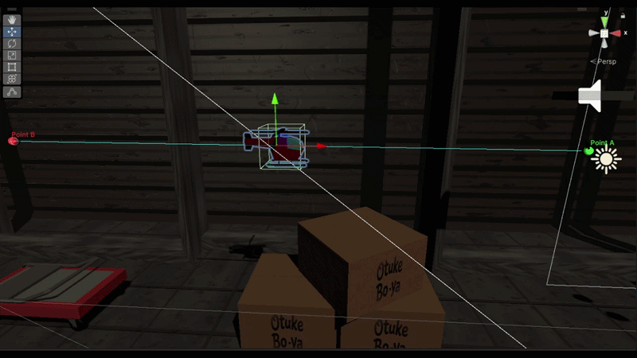
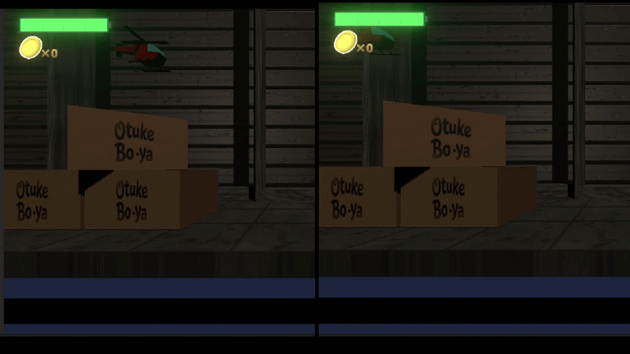
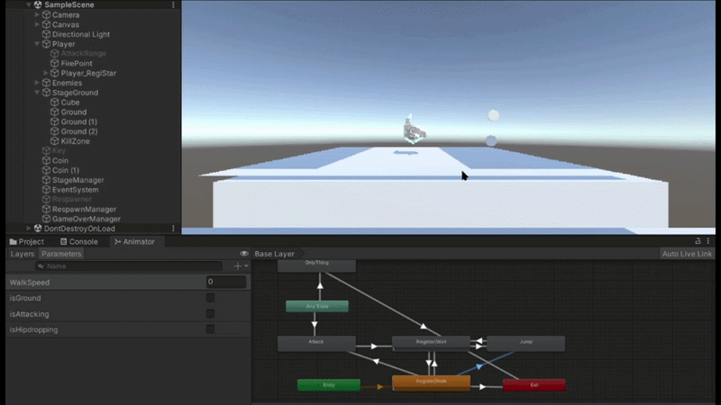
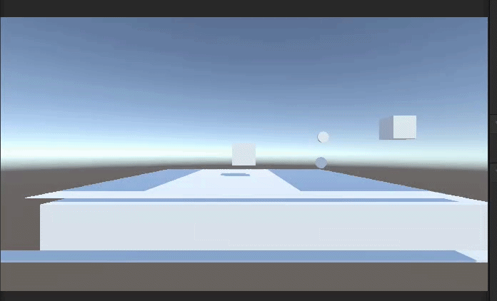

# 開発・設計詳細 (Implementation Details)

本ドキュメントでは、「DataBackTo」の開発プロセス、システムアーキテクチャ、および直面した技術的課題とその解決策について解説します。

---

## 👥 開発体制と役割分担

本作は2名のチームで開発を行いました。それぞれが担当領域を持ちつつ、GitHubを用いたバージョン管理を通じて連携しています。

* **TodoSota (開発主導)**: 
  * プロジェクトマネジメント、企画設計
  * コアゲームループ・状態保存（レシート）システムの基盤構築
  * 3Dモデルの作成（Blender）およびUnityへの組み込み・アニメーション制御
* **otukebo-ya (システム拡張・AI)**:
  * ステージ選択画面の作成 
  * 敵AI（ステートマシン・巡回ロジック）の設計・構築
  * コアシステムとUIの連動処理（イベント駆動設計）
  * 各種UI素材の作成と不足機能の実装

---

## 🛠️ プロジェクト管理と開発フロー

### 「変更耐性」を優先したMVPアプローチ (TodoSota)
最初から完成形を目指して開発が頓挫するのを防ぐため、開発工程を2段階に分けました。
前半は「最適化よりも変更に対する損失を最小化する」ことを目標とし、プレースホルダー（仮素材）を用いてコアとなるゲームループを最速で構築しました。この土台があったことで、後半の体験拡張（AIの追加やUIの連携）をスムーズに並行作業することができました。

### 企画を並行した柔軟な制作進行
上記の「最小の土台」からスタートしたため、企画やゲーム仕様の多くが未定のまま制作を進行することになりました。
そのため、2名で担当領域を分担しつつも、既存の実装や今後の作業内容について密に連携をとる必要がありました。結果として、仕様の変更にも柔軟に対応でき、理想とするゲーム体験と技術的な実装の落としどころを、話し合いの中でバランス良く見つけながら組み上げることができました。

### ブランチ戦略と反省点（TodoSota）
GitHubの運用では、`main` ブランチの上に `DevelopOrigin` という仮想の統合ブランチを設け、そこから各自が作業ブランチを切るフローを採用しました。
しかし、実際には「誰がいつ `main` を更新するのか」というルールが曖昧になり、`DevelopOrigin` のみが更新され続けるという不安定な状態に陥りました。この経験から、少人数開発であっても、プルリクエストの承認ルールや統合のタイミング（スプリントの区切りなど）を明確に定めておく必要性を痛感し、今後のチーム開発への大きな学びとなりました。

一方で、`DevelopOrigin` のような統合ブランチが完全に不要だったわけではありません。テキスト（YAML形式）で管理されるUnityのSceneやヒエラルキーは、GitHub上で非常にコンフリクトが発生しやすく、解消にはGit Bash等を用いた複雑な操作が要求されることがあります。実際、開発中に何度か深刻なコンフリクトが発生したため、「いつでも上書き・参照可能な最新の安定バージョン」として `DevelopOrigin` が存在すること自体には、大きな意義があったと感じています。

---

## ⚙️ システムアーキテクチャと実装詳細

### 1. 状態保存・復帰システム（TodoSota）
ゲームのコアである「レシートによる状態の巻き戻し」は、独自のデータ構造を用いて実装しています。
プレイヤーのHP、所持コイン、ジャンプ回数などの状態を`ReceiptData`という構造体（Struct）にパッケージ化し、それを`List`を用いて履歴として保持しています。これにより、任意のタイミングでの状態スナップショットと、データの上書きによるシームレスな復帰を実現しました。

### 2. UIと内部ロジックの疎結合化（otukebo-ya）
UI（HPバーやレシート残量表示）の更新処理には、**オブザーバーパターン（UnityEventを活用したイベント駆動）**を採用しています。
`ReceiptSystem`内部で状態が変化した際、直接UIのスクリプトを呼び出すのではなく、イベント（`OnReceiptUpdate`）を発火させる設計にしました。これにより、ゲームのコアロジックとUIの描画処理が完全に切り離され（疎結合化）、後から新しいUIや演出を追加する際もシステム側のコードを改修する必要がない、高い拡張性を確保しました。

---

## 🤖 AIとビジュアルの構築

### 1. ステートパターンとエディタ拡張を用いた敵AIの実装（otukebo-ya）
敵のAI実装においては、保守性と開発効率（DX）を高めるため、以下の技術的アプローチを採用しています。

**■ ステートパターンによる状態管理のカプセル化**
敵の挙動（巡回、発見、攻撃、ノックバック、死亡）は、ステートパターン（ `IEnemyState.cs` 等）を用いて個別のクラスとしてカプセル化しました。`EnemyController` 側は現在のステートを実行するだけで処理が完結するため、複雑な条件分岐（if文やswitch文）によるスパゲッティコードを完全に排除しています。また、`EnemyMotor` を基底クラスとして共通動作をまとめ、そこから派生させる形で個別の振る舞い（浮遊型の巡回など）を拡張可能な設計としています。

**■ 独自エディタ拡張によるレベルデザインの効率化**
単なるデバッグ表示にとどまらず、巡回ルートを直感的に設定できるようUnityのカスタムエディタ（ `WaypointPathEditor.cs` ）を自作しました。インスペクターの数値を直接編集するのではなく、シーンビュー上でマウス操作によってパス（Waypoint）を編集可能にすることで、レベルデザインの作業効率を大幅に向上させています。

**■ 基本となる巡回（Patrol）ステートの挙動**

> 視界にプレイヤーがいない状態での、ステートマシンによる基本的な動作確認です。

**■ エディタ上での直感的なWaypoint変更**

> 自作のカスタムエディタにより、空間上でA地点・B地点（探知・移動範囲）を視覚的に確認しながら変更している様子です。

**■ カプセル化によるルートの量産と配置**

> 共通の土台（クラス）を用いながら、インスペクターからの調整のみで、それぞれ異なる巡回経路を持つ敵を容易に配置・比較できることを示しています。

### 2. 3Dモデルを用いた2Dアクションの表現（TodoSota）
本作は2D横スクロールアクションですが、キャラクターや一部のプロップにはBlenderで作成した3Dモデルを採用し、Perspective（透視投影）カメラを用いて奥行きのあるビジュアルを作っています。
Unityでのアニメーション制御（Animator）は今回が初の試みであり、開発初期は`Any State`と`Entry`の仕様の違いに苦戦しました。（例：空中にいる間に姿勢がリセットされる、待機モーションがループしない等）。最終的にはステートの遷移条件（Transition）を整理し、プレイヤーの操作入力とモデルの挙動が違和感なく連動する状態まで組み上げることができました。

**■ Animatorによるステート遷移とモーション制御**

> ゲーム実行中のAnimatorの遷移状況です。待機や移動といった基本動作はEntryからの遷移で構築し、どのアクション中でも即座に割り込む必要がある特殊な挙動にはAny Stateを活用するなど、仕様への理解を深めながら適切なモーション制御を実現しました。

### 3. 動的バーコード生成によるUI演出（otukebo-ya）

**■ 規格に基づいたバーコード演出**

本作の世界観（レジスター、レシートなど）をより強調するビジュアル表現として、「Code128」というバーコード規格を独自に調査し、任意の英数字テキストから動的にバーコード画像を生成するプログラム（ `CodeGenerator.cs` ）を実装しました。この機能を活用し、ステージ選択画面などの画面遷移において、世界観とシステムがリンクしたこだわりのUI演出を実現しています。
