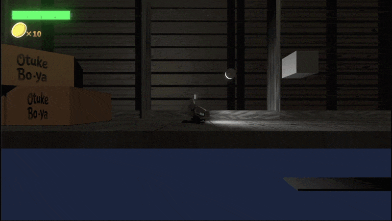
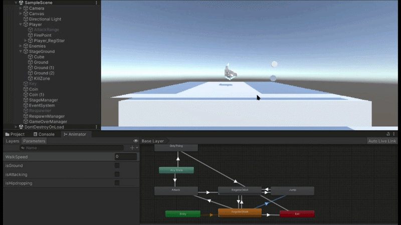
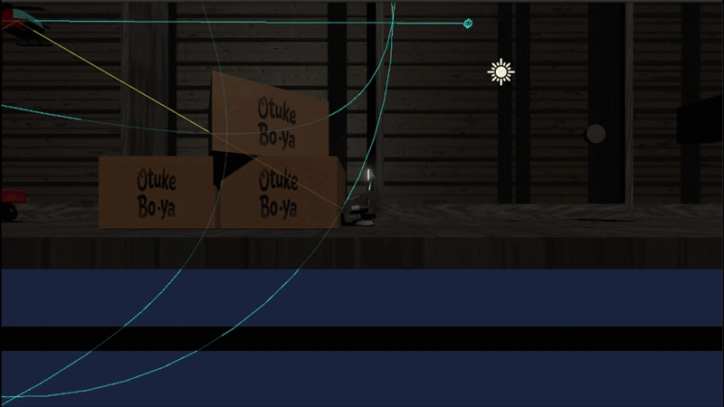
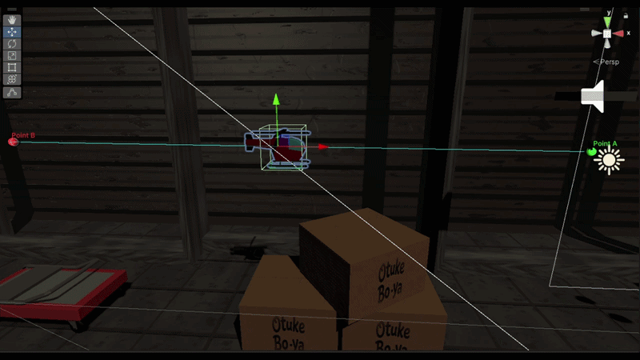
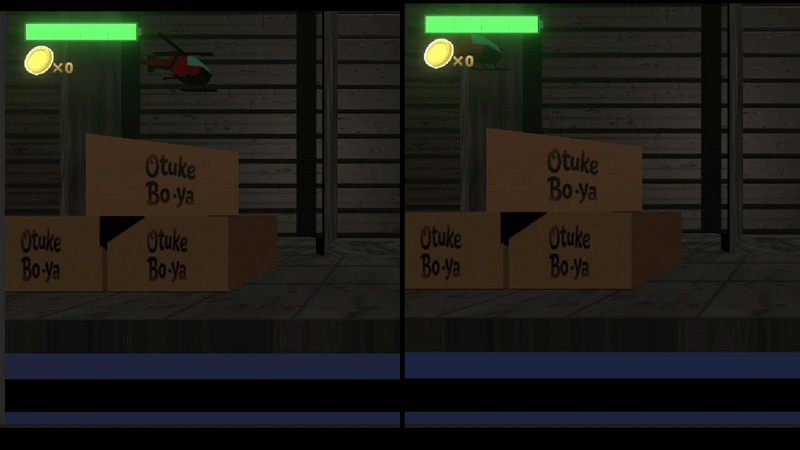
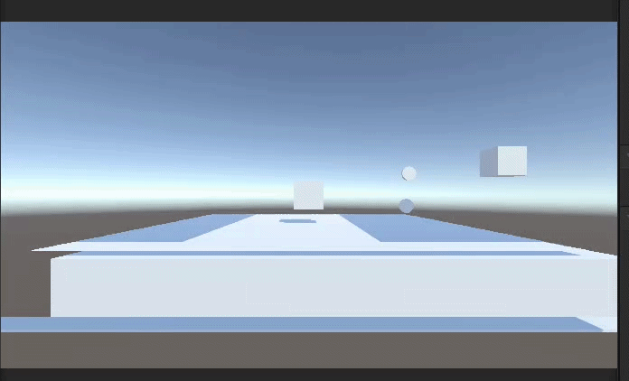

# 開発・設計詳細 (Implementation Details)

本ドキュメントでは、「DataBackTo」の開発プロセス、システムアーキテクチャ、および直面した技術的課題とその解決策について解説します。

---

## 👥 開発体制と役割分担

本作は2名のチームで開発を行いました。それぞれが担当領域を持ちつつ、GitHubを用いたバージョン管理を通じて連携しています。

* **TodoSota (開発主導)**: 
  * プロジェクトマネジメント、企画設計
  * コアゲームループ・状態保存（レシート）システムの基盤構築
  * 3Dモデルの作成（Blender）およびUnityへの組み込み・アニメーション制御
* **otukebo-ya (システム拡張・AI)**:
  * ステージ選択画面の作成 
  * 敵AI（ステートマシン・巡回ロジック）の設計・構築
  * コアシステムとUIの連動処理（イベント駆動設計）
  * 各種UI素材の作成と不足機能の実装

---

## 🏗️ TodoSota: プロジェクト基盤・3D演出・コアシステム
プロジェクトの全体設計に加え、ゲームの「手触り」と「独自演出」を技術的に支える基盤を構築しました。

### 1. 「変更耐性」を優先したMVPアプローチ
開発の頓挫を防ぐため、工程を2段階に分割。 前半はプレースホルダーを用いてコアとなるゲームループを最速で構築し、後半の体験拡張をスムーズに並行作業できる土台を作りました。

### 2. 状態保存・復帰システムの実装
ゲームの核である「レシートによる巻き戻し」を支えるため、プレイヤーの状態（HP、コイン等）をReceiptData構造体にパッケージ化。 Listによる履歴保持により、シームレスなデータ復帰を実現しました。

### 3. ShaderGraphによる「スキャン演出」と実装の葛藤
「レジが状態を保存する」というコンセプトを視覚化するため、ShaderGraphを用いたスキャン演出を実装しました。

技術実装: PositionノードとSplitノードで範囲を指定し、OneMinusで反転させたマスクに赤色を乗せるシンプルな構成。 座標値を動的に変化させることで、全身を下から走査するようなエフェクトを表現しています。
モーション連携: レシート発行時に「片手を挙げる」アクションを追加。 既存のガッツポーズから動作を切り出し、エフェクトと同期させました。空中で発動の際にはアクションはしないようになっています。

ゲーム体験とのトレードオフ:
演出を完全に終えてから状態保存（SaveState）を行うコールバック処理を実装。 これにより「長押し＋演出時間」分だけ待ち時間が発生することになり、テンポを重視するか世界観を重視するか、チーム内で議論を重ねた末のこだわりの挙動となっています。

### 4. 3Dモデルを用いた2Dアクションの表現
Blenderで作成した3Dモデルを2Dアクションへ落とし込むため、Animatorの遷移条件（Transition）を徹底的に整理。 Any StateとEntryを使い分け、入力に違和感なく連動する挙動を追求しました。
**■ Animatorによるステート遷移とモーション制御**

---

## 🤖 otukebo-ya: システム拡張・AI・UI演出
コアシステムを拡張し、ゲームとしての「密度」と「プレイの快適性」を高める仕組みを構築しました。

### 1. ステートパターンを用いた敵AIの実装
敵の挙動を個別のクラスとしてカプセル化（巡回、発見、攻撃等）。 複雑な条件分岐を排除し、拡張性の高いAIを実現しています。
**■ 基本となる巡回（Patrol）ステートの挙動**

> 視界にプレイヤーがいる状態、いない状態での、ステートマシンによる基本的な動作確認です。

### 2. 独自エディタ拡張によるレベルデザイン効率化
Unityのカスタムエディタ（WaypointPathEditor.cs）を自作。 シーンビュー上でパスを直感的に編集可能にし、作業効率を劇的に向上させました。
**■ エディタ上での直感的なWaypoint変更**

> 自作のカスタムエディタにより、空間上でA地点・B地点（探知・移動範囲）を視覚的に確認しながら変更している様子です。

**■ カプセル化によるルートの量産と配置**

> 共通の土台（クラス）を用いながら、インスペクターからの調整のみで、それぞれ異なる巡回経路を持つ敵を容易に配置・比較できることを示しています。

### 3. オブザーバーパターンによるUIとロジックの疎結合化
ReceiptSystemの状態変化をイベントとして発火させる設計を採用。 コアロジックを改修せずに新しい演出を追加できる拡張性を確保しました。

### 4. 動的バーコード生成（Code128）によるUI演出
「レジスター・レシート」の世界観を補強するため、規格に基づいたバーコード生成プログラム（CodeGenerator.cs）を実装。 ステージ選択等の画面遷移に活用しています。

> 画面遷移時の演出です。「Test Text」の文字によってコードが生成されるようになっています。

---

## 🛠️ プロジェクト管理と振り返り
### ブランチ戦略と教訓
DevelopOriginという統合ブランチを設けるフローを採用。 Unity特有のSceneコンフリクト問題への対策としては機能したものの、統合ルールの曖昧さが課題となりました。 この経験から、少人数開発における運用ルール明確化の重要性を痛感しました。
